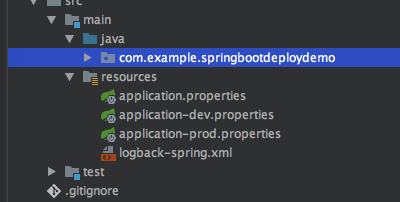
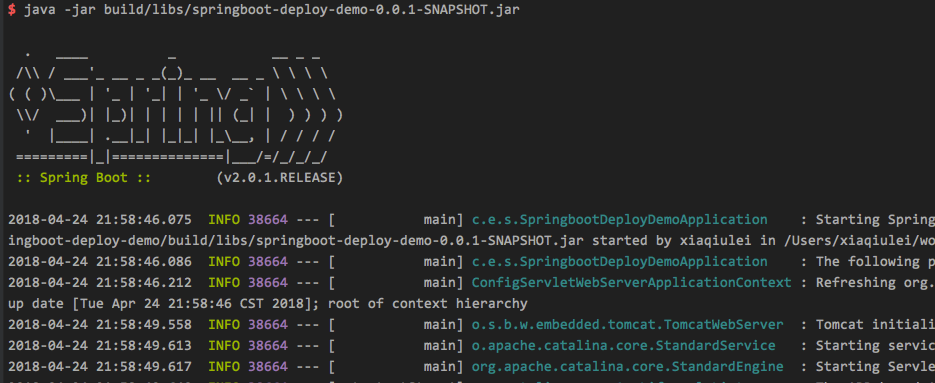

# Spring Boot 项目自动发布

---


## 简介

在公司从移动端转后端已经快一年了，使用的技术框架一直是Spring Boot，和以前大学时候基于Tomcat的不太一样。

这篇文章简单介绍下如何发布Spring Boot 项目，原先使用Tomcat时候，发布的文件是war文件，现在使用Spring Boot就变得很简单了，直接是一个jar文件，启动方式按照启动jar文件方式即可。


## 准备工作

使用Idea创建一个带Spring Boot的项目，使用gradle管理项目。

使用gradle依赖很简单，同时创建两个Controller，一个用户表示线上api接口，一个表示心跳接口，用于测试。

```groovy
dependencies {
    compileOnly('org.projectlombok:lombok')

    compile('org.springframework.boot:spring-boot-starter-web')

    testCompile('org.springframework.boot:spring-boot-starter-test')
}
```

```java
@Slf4j
@RestController
public class HelloWorldController {

    @Value("${app.env}")
    String env;

    @RequestMapping(path = "/hello", method = RequestMethod.GET)
    public Object hello() {
        log.info("hello>>>");

        Map<String, Object> map = new HashMap<>();
        map.put("hello", "world");
        map.put("env", env);

        log.info("map = " + map);
        return map;
    }
}
```

```java
@Slf4j
@RestController
public class HeartbeatController {

    @RequestMapping(path = "/heartbeat")
    public Object heartbeat() {
        return "success";
    }
}
```

同时配置好对应的配置文件，我这又三个配置文件，一个dev环境，一个表示prod环境，还有一个表示开关。



Spring支持选择对应的config文件，开发时候，配置成dev，则生效的文件`application-dev.properties`。

```properties
spring.profiles.active=dev
#spring.profiles.active=prod
```

dev

```properties
server.port=8080
app.env=dev
logging.config=classpath:logback-spring.xml
```

prod

```properties
server.port=8081
app.env=prod
logging.config=classpath:logback-spring.xml
```

我这边用`app.env`字段表示不同环境的内容，实际情况，可以配置数据库的内容，开发和线上的数据库是不一样的。

启动程序，然后测试下请求。

```bash
curl http://127.0.0.1:8080/hello    
{"hello":"world","env":"dev"}
```

数据是正常的，env读取的也是dev数据。

## 编译和发布

由于项目使用gradle管理，那么在发布时候，直接使用gradle编译，命令如下，clean是可选的，不过一般在本地开发在发布，建议先clean
下。

```bash
./gradlew clean build
```

编译成功后，在项目生成目录中可以找到对应的jar文件，路径是`./build/libs/springboot-deploy-demo-0.0.1-SNAPSHOT.jar`。

可以直接使用java命令来启动。




为了方便起我在项目中写个简单脚本，编译成功后，复制目标文件到响应的目录，然后直接同步到服务器即可。

```bash
#!/usr/bin/env bash

./gradlew clean build

cp build/libs/* deploy/
```

deploy 目录除了有目标文件外，还有线上环境的配置文件，几个服务启动停止的文件。

start.sh，很简单，在启动前，检查是否已经启动，在没有启动情况下，在启动服务。

```bash
#!/bin/sh


#get pwd
DIR_HOME="${BASH_SOURCE-$0}"
DIR_HOME="$(dirname "$DIR_HOME")"
PRGDIR="$(cd "${DIR_HOME}"; pwd)"


jarfile=$PRGDIR/springboot-deploy-demo-0.0.1-SNAPSHOT.jar


#get runing pid
pid=$(ps -ef | grep java | grep $jarfile | awk '{print $2}')

#create log dir
mkdir -p $PRGDIR/log/

if [ "$pid" != "" ];then
    echo "ERROR: $jarfile is running! pid=$pid. You must stop it first!"
else
    nohup java -jar $jarfile -Dfile.encoding=UTF-8 --spring.config.location=$PRGDIR/ >$PRGDIR/log/start.log 2>&1 &
    pid=$(ps -ef | grep java | grep $jarfile | awk '{print $2}')
    echo "INFO: $jarfile is running! pid=$pid"

    url="http://127.0.0.1:8088/heartbeat";
    echo $url
    while [ true ]
    do
        sleep 1
        HTTP_CODE=`curl -G -m 10 -o /dev/null -s -w %{http_code} $url`
        echo "http code: ${HTTP_CODE}"
        if [ ${HTTP_CODE} -eq 200 ]
        then
            echo "server start success..."
            exit 0
        fi
    done
fi
```

同时启动前，需要配置spring boot运行的参数，最重要的有Spring Boot启动的配置文件的位置`--spring.config.location`，我配置的位置是`./`。

需要注意的是，prod的配置文件，一些参数需要注意路径，开发中路径是`classpath:`开头，线上是不需要的。

```properties
server.port=8081
app.env=prod
logging.config=logback-spring.xml
```

在启动服务后，会尝试调用接口，测试启动是否成功。

```bash
url="http://127.0.0.1:8088/heartbeat";
echo $url
while [ true ]
do
    sleep 1
    HTTP_CODE=`curl -G -m 10 -o /dev/null -s -w %{http_code} $url`
    echo "http code: ${HTTP_CODE}"
    if [ ${HTTP_CODE} -eq 200 ]
    then
        echo "server start success..."
        exit 0
    fi
done
```

stop.sh

停止服务很简单，直接查找对于的进程，然后杀掉，这里需要注意进程名字是以jar文件来查找的。

```bash
#!/bin/sh

process=springboot-deploy-demo-0.0.1-SNAPSHOT.jar

ifrun=$(ps -ef | grep $process | grep java)
if [ "$ifrun" != "" ];then
    kill -9 `ps -ef | grep $process | grep java | awk '{print $2}'`
    echo "INFO: $process is stoped!"
else
    echo "WARN: Not found $process running."
fi
```

restart.sh

这个比较简单，就是先停止，再启动。

```bash
#!/bin/sh

./stop.sh
./start.sh
```

## 同步到服务器

这里做简单演示，我使用一Ubuntu虚拟机，使用scp命令上传到服务器上，实际情况可以根据自己需求来选择，比如使用svn，ftp等。

```bash
scp deploy/* xiaqiulei@172.16.90.128:~/deploy
```

然后ssh登陆上`172.16.90.128`机器，进入`deploy`目录，执行`./start`即可。

## 总结

本文只是简单介绍使相关脚本发布Spring Boot服务到linux机器上，基本满足小项目需求。

当然了，还有不够完善的地方，比如启动的方式是`nohup`，当进程挂掉以后，不能够自动重启，高级的用法是使用`supervisor`。

再比如，scp同步的时候，都是简单的文件覆盖，比较友好的方式是，先备份原先的文件，然后再同步文件，这样如果服务有问题，还可以回滚。